# 🏠 House Sale Price Prediction


An end-to-end machine-learning project that predicts the sale price of residential
properties from their structural, location, quality, condition, and sale-related
features. The project walks through the complete pipeline — from raw data inspection
and exploratory data analysis, through preprocessing, model training, and rigorous
evaluation — and includes a classification extension that predicts whether a house
sells above or below the median price.

---

## 📋 Table of Contents

- [Overview](#-overview)
- [Dataset](#-dataset)
- [Project Workflow](#-project-workflow)
- [Results](#-results)
- [Visualizations](#-visualizations)
- [Project Structure](#-project-structure)
- [Getting Started](#-getting-started)
- [Tech Stack](#-tech-stack)
- [License](#-license)

---

## 🎯 Overview

The goal is to build a complete, reproducible machine-learning pipeline that learns
the relationship between house characteristics and their actual sale price. Two
complementary models are built:

- **Linear Regression** — predicts the exact sale price of a property (regression).
- **Logistic Regression** — predicts whether a property sells at or above the median
  price (classification), demonstrating precision, recall, F1, and confusion-matrix
  analysis on a problem where those metrics are meaningful.

Every stage is documented in the notebook with the reasoning behind each decision,
making this both a working model and a teaching walkthrough of a real ML workflow.

---

## 📊 Dataset

The project uses the well-known **Ames Housing** dataset (the same data behind the
Kaggle *House Prices: Advanced Regression Techniques* competition).

- **1,460** residential property records
- **81** columns — 79 candidate features, one identifier (`Id`), and the target `SalePrice`
- A mix of numerical measurements, ordinal quality scores, and categorical features
- `data/data_description.txt` documents the meaning of every column

---

## 🔬 Project Workflow

1. Define the house-price prediction problem
2. Load the raw, uncleaned housing dataset
3. Inspect rows, columns, features, and the target variable
4. Separate numerical and categorical variables
5. Analyze missing values (and distinguish "absent feature" from "unknown")
6. Check for duplicate and invalid records
7. Analyze the target distribution (skewness, outliers, log transform)
8. Visualize numerical distributions, box plots, and zero-heavy features
9. Split into train/test sets **before** fitting any preprocessing
10. Build a preprocessing pipeline (imputation + scaling + one-hot encoding)
11. Train and evaluate the Linear Regression model
12. Extend to a classification problem and evaluate with classification metrics
13. Persist both trained pipelines with `joblib`

> **Note on leakage:** all preprocessing statistics (medians, encoders, scalers) are
> learned **only** from the training set and then applied to the test set, so the
> evaluation reflects genuine generalization.

---

## 🏆 Results

### Linear Regression (price prediction)

| Metric | Score |
| --- | --- |
| Mean Absolute Error (MAE) | ~$21,140 |
| Root Mean Squared Error (RMSE) | ~$31,791 |
| R² Score | **0.8682** |

The model explains roughly **87%** of the variation in test-set sale prices.

### Logistic Regression (above/below median price)

| Metric | Score |
| --- | --- |
| Accuracy | ~94.5% |
| Precision | ~92.5% |
| Recall | ~95.4% |
| F1 Score | ~93.9% |

Confusion matrix on the test set: **TP = 124, TN = 152, FP = 10, FN = 6**.

---

## 📈 Visualizations

### Target Variable Analysis

The sale price is strongly right-skewed (skewness ≈ 1.88); a log transform makes the
distribution far closer to normal.

| Distribution | Box Plot | Log Transform |
| --- | --- | --- |
| 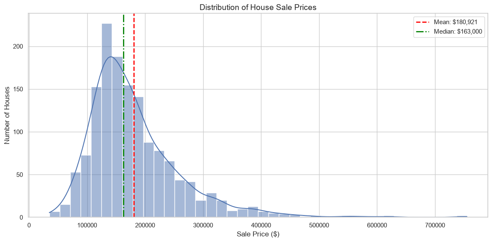 | 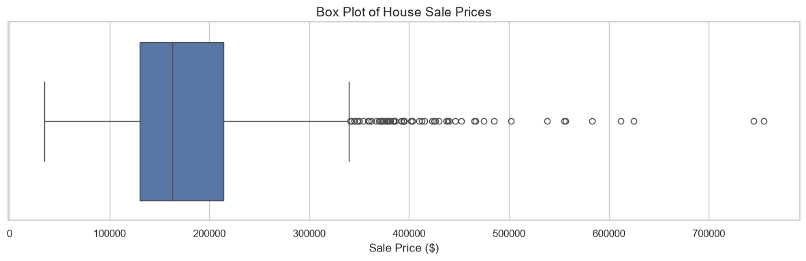 | 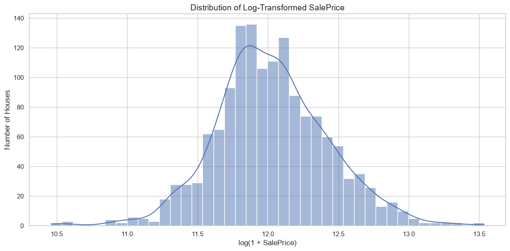 |

### Missing-Value Analysis

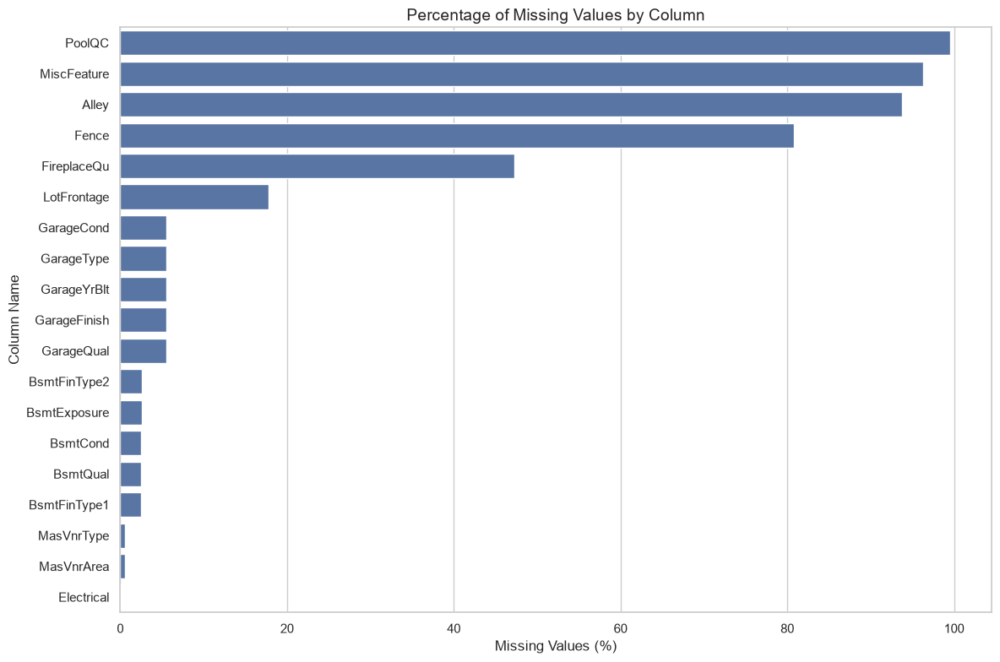

### Exploratory Data Analysis

| Numerical Distributions | Box Plots (outliers) | Zero-Value Features |
| --- | --- | --- |
| 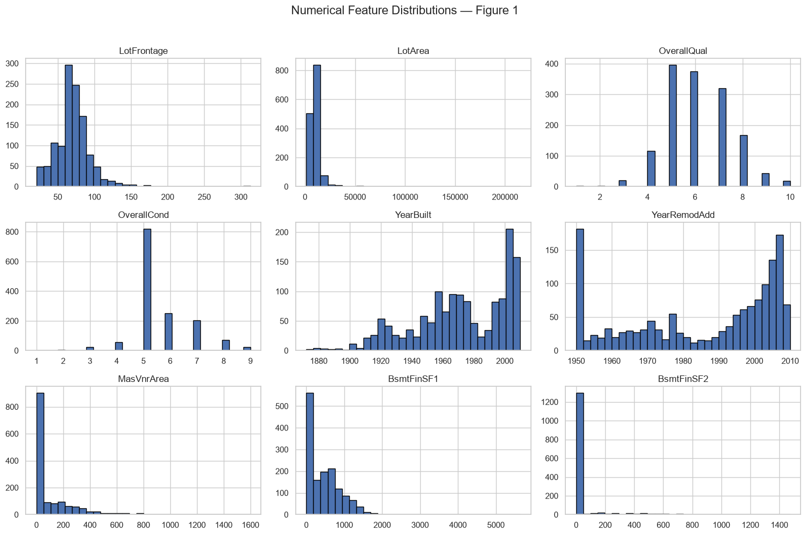 | 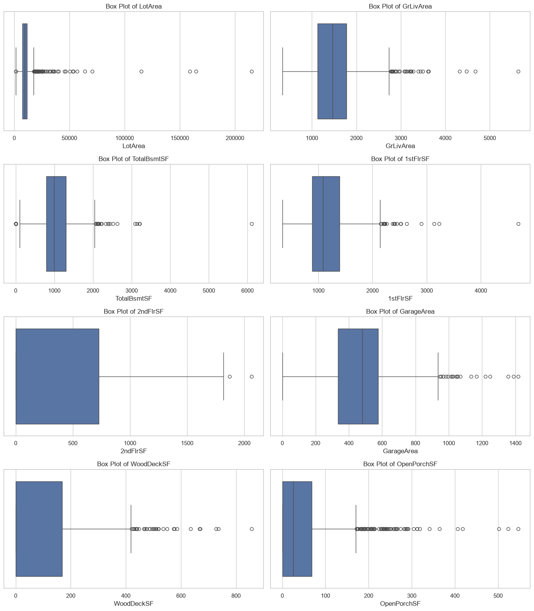 | 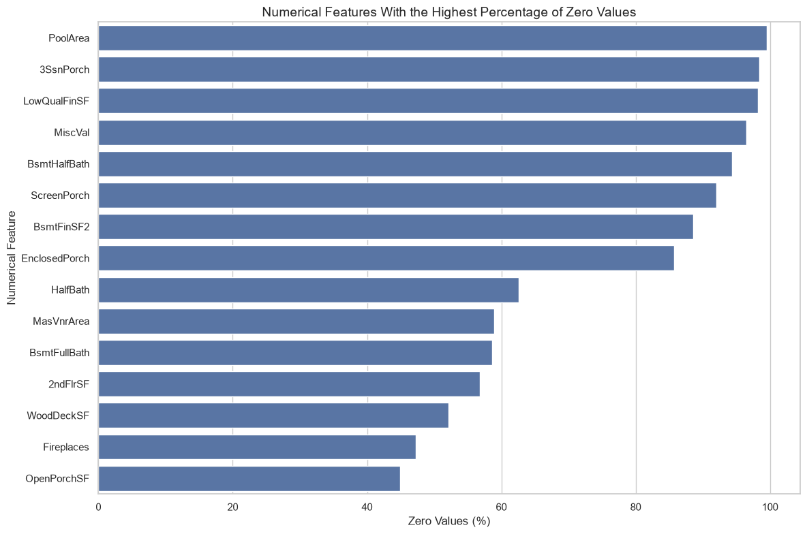 |

### Model Evaluation

| Actual vs. Predicted | Residuals vs. Predicted | Residual Distribution |
| --- | --- | --- |
| 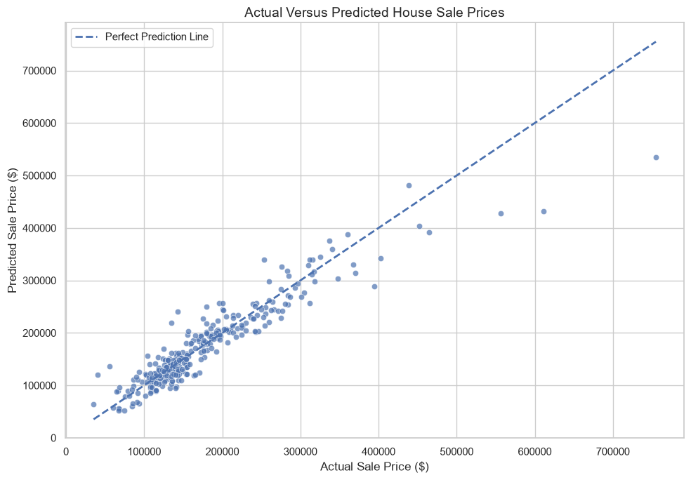 | 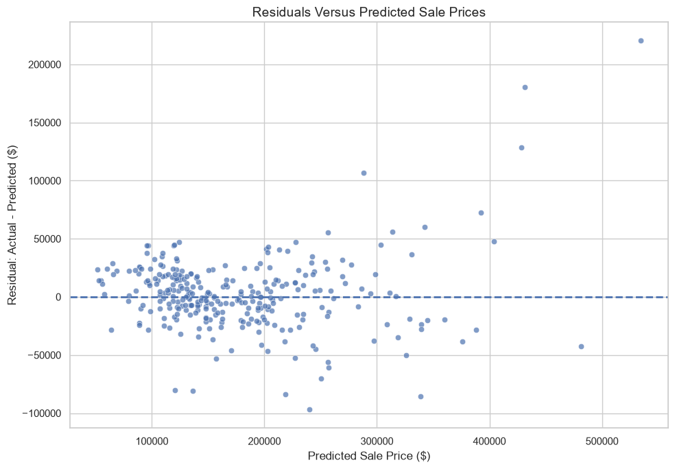 | 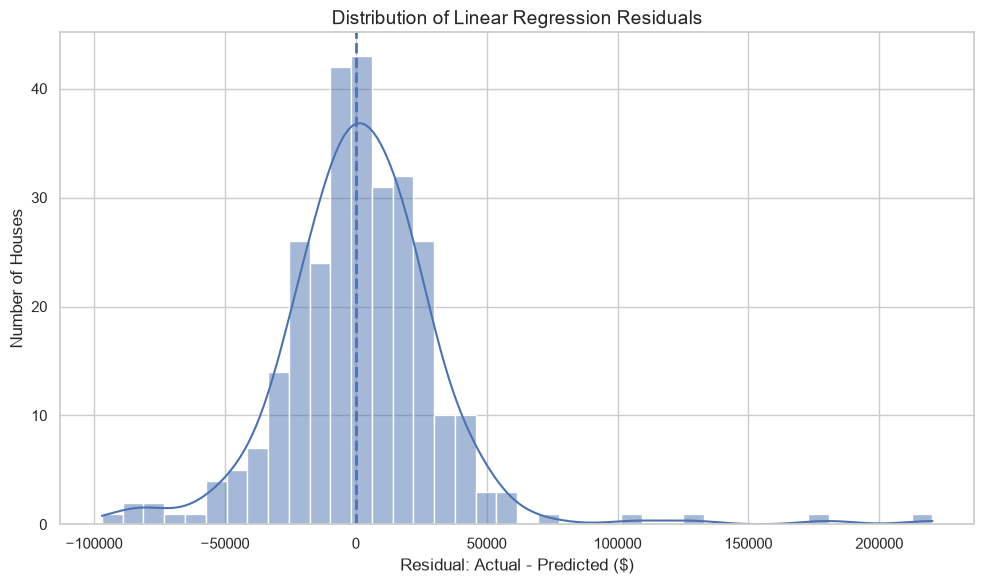 |

### Classification Confusion Matrix

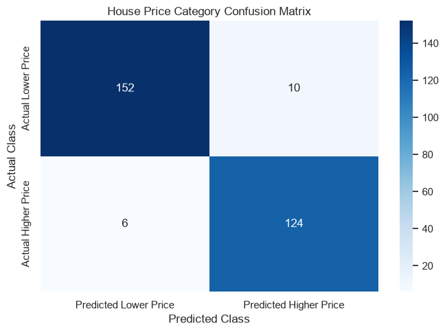

---

## 🗂 Project Structure

```
house-price-prediction/
├── data/
│   ├── train.csv                 # Ames housing dataset (1,460 records)
│   └── data_description.txt      # Column-by-column data dictionary
├── models/
│   ├── linear_regression_pipeline.joblib     # Trained regression pipeline
│   └── classification_pipeline.joblib        # Trained classification pipeline
├── notebooks/
│   └── house_price_prediction.ipynb          # Full analysis & modeling notebook
├── images/                       # Exported charts used in this README
├── requirements.txt
├── .gitignore
├── LICENSE
└── README.md
```

---

## 🚀 Getting Started

### 1. Clone the repository

```bash
git clone https://github.com/<your-username>/house-price-prediction.git
cd house-price-prediction
```

### 2. Create a virtual environment and install dependencies

```bash
python -m venv .venv
# Windows
.venv\Scripts\activate
# macOS / Linux
source .venv/bin/activate

pip install -r requirements.txt
```

### 3. Run the notebook

```bash
jupyter notebook notebooks/house_price_prediction.ipynb
```

### 4. Use a saved model

```python
import joblib
import pandas as pd

model = joblib.load("models/linear_regression_pipeline.joblib")
# X_new must contain the same feature columns as the training data
predictions = model.predict(X_new)
```

---

## 🛠 Tech Stack

- **Python** — core language
- **pandas / NumPy** — data manipulation
- **scikit-learn** — preprocessing pipelines, Linear & Logistic Regression, metrics
- **Matplotlib / Seaborn** — visualization
- **joblib** — model persistence
- **Jupyter Notebook** — interactive analysis

---

## 📄 License

This project is released under the [MIT License](LICENSE).

---

<p align="center">Built by <strong>Mohammad Hassan</strong></p>
